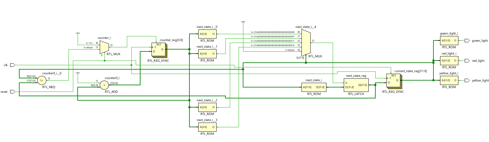
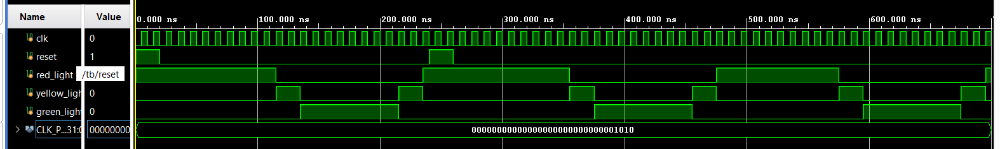

# 🚦 Traffic Light Controller – System Verilog Project

This project implements a **Traffic Light Controller** using **System Verilog** based on a finite state machine (FSM) model. It simulates a real-world 4-phase traffic light system with timed transitions.

## 📁 Module: `traffic_light_controller`

### 🔧 Inputs:
- `clk`: Clock signal
- `reset`: Active-high synchronous reset

### 🔦 Outputs:
- `red_light`
- `yellow_light`
- `green_light`

## 🔁 FSM States:
1. `RED_STATE`
2. `RED_YELLOW_STATE`
3. `GREEN_STATE`
4. `YELLOW_STATE`

State transition flow:  
**RED → RED+YELLOW → GREEN → YELLOW → RED** (loop)

## ⏱️ Timing Parameters:
- `RED_TIME = 10` cycles
- `YELLOW_TIME = 2` cycles
- `GREEN_TIME = 8` cycles

## 🔑 Key Features

- **4-State FSM**: Clear state transitions modeled using enumerated types.
- **Counter-Based Timing**: A 4-bit counter controls how long each state lasts.
- **Synchronous Logic**: Triggered on `posedge clk`, with reset for initialization.
- **Moore Machine Design**: Outputs are based only on the current state.
- **Clean Code Structure**: Separation between `always_ff` for sequential logic and `always_comb` for next-state and output logic.
- **Simulation Ready**: Includes testbench with `$monitor`, `$dumpfile`, and GTKWave-compatible VCD output.
- **Compact & Synthesizable**: Delay-free and fully hardware compatible.

## 🧪 Testbench Highlights

The testbench drives:
- Clock generation (`#5 clk = ~clk`)
- Reset logic
- Monitored output with `$monitor`
- Waveform output for GTKWave

## 🧠 Learning Outcome

This project reinforced concepts like:
- Finite State Machine design in Verilog
- Behavioral vs. Structural modeling
- Testbench creation and simulation analysis
- Timing and output stability in synchronous systems

---

With every step in RTL design, small efforts like this build strong fundamentals in digital design and verification.
